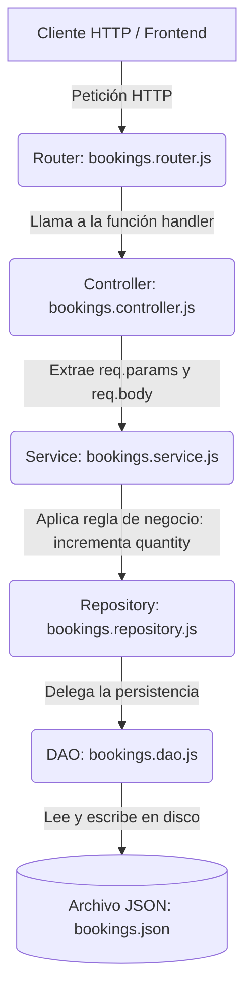

# 🎓 Masterclass: Refactorización a Arquitectura en Capas (DAO & Repository Pattern)

¡Bienvenido/a a esta clase práctica de arquitectura backend en Node.js! En este documento vas a aprender **de punta a punta** cómo reorganizamos una API de sistema de turnos y reservas utilizando **Arquitectura en Capas**, aplicando los patrones **DAO (Data Access Object)** y **Repository**.

---

## 📌 1. ¿Por qué hicimos este refactor? (El problema inicial)

### ❌ El problema del código "Espagueti"
Antes del refactor, el proyecto tenía varios problemas de diseño:
1. **Controllers sobrecargados**: Leían `req`, validaban datos, accedían a los archivos JSON mediante `fs` y respondían la petición `res`.
2. **Mezcla de responsabilidades**: Las reglas de negocio (como saber si un servicio ya existe en una reserva para incrementar su cantidad) estaban en la capa de datos o mezcladas en la persistencia.
3. **Imposible de testear o cambiar**: Si mañana quisiéramos cambiar el archivo JSON por una base de datos MongoDB o PostgreSQL, tendríamos que reescribir prácticamente todo el sistema.

### ✅ La solución: Arquitectura en Capas
Separamos el código en **capas especializadas**, donde cada una tiene una única responsabilidad (*Single Responsibility Principle*).

---

## 🍽️ 2. La Metáfora del Restaurante (Para entenderlo en 1 minuto)

Para recordar fácilmente qué hace cada capa, imagina que nuestra API es un restaurante:

| Capa | Rol en el Restaurante | Responsabilidad en el Código |
| :--- | :--- | :--- |
| **Router** | 📋 **El Menú** | Define qué platos (endpoints) están disponibles y hacia dónde dirigir al cliente. |
| **Controller** | 🤵 **El Mozo / Mesero** | Recibe la orden del cliente (`req`), se la entrega a la cocina, y luego le trae la comida lista (`res`). **¡No cocina!** |
| **Service** | 👩‍🍳 **El Chef / La Cocina** | Aplica las recetas y **reglas de negocio** (ej: si pides doble queso, incrementa la porción). No habla con el cliente. |
| **Repository** | 📦 **El Encargado de Despensa** | Sabe qué ingredientes pedir a la alacena sin preocuparse de cómo están almacenados. |
| **DAO** | 🔑 **El Guardián del Almacén** | Abre la puerta del almacén, lee el archivo JSON de las repisas y lo vuelve a guardar en el disco. |

---

## 🔄 3. Flujo de Datos Completo (Paso a Paso)

Cuando un usuario hace una petición HTTP (por ejemplo, `POST /api/bookings/123/services/1`), la información viaja así:



---

## 📂 4. Estructura de Carpetas del Proyecto

```text
src/
├── config/
│   └── env.config.js          # Configuración de variables de entorno (.env)
├── controllers/
│   ├── services.controller.js # Maneja req/res de Servicios
│   └── bookings.controller.js # Maneja req/res de Reservas
├── services/
│   ├── services.service.js   # Reglas de negocio de Servicios
│   └── bookings.service.js   # Reglas de negocio de Reservas
├── repositories/
│   ├── services.repository.js# Métodos de acceso a datos de Servicios
│   └── bookings.repository.js# Métodos de acceso a datos de Reservas
├── dao/
│   ├── services.dao.js       # Operaciones I/O directas sobre services.json
│   └── bookings.dao.js       # Operaciones I/O directas sobre bookings.json
├── routes/
│   ├── services.router.js     # Endpoints de Servicios
│   └── bookings.router.js     # Endpoints de Reservas
├── data/
│   ├── services.json         # Archivo JSON de persistencia de Servicios
│   └── bookings.json         # Archivo JSON de persistencia de Reservas
├── app.js                    # Configuración de Express y middlewares
└── server.js                 # Punto de entrada de la aplicación
```

---

## 💻 5. Explicación Código por Código

### 📦 Capa 1: DAO (Data Access Object)
**Ubicación**: `src/dao/services.dao.js` y `src/dao/bookings.dao.js`

El DAO es el **único módulo** en todo el proyecto que importa `fs` para leer y escribir los archivos JSON. No contiene ninguna validación ni regla de negocio.

```javascript
// src/dao/bookings.dao.js
import fs from 'fs';
import path from 'path';

class BookingsDao {
    async _readData() {
        const data = await fs.promises.readFile(this.path, 'utf-8');
        return JSON.parse(data);
    }

    async _writeData(data) {
        await fs.promises.writeFile(this.path, JSON.stringify(data, null, 2), 'utf-8');
    }

    async getById(id) {
        const bookings = await this._readData();
        return bookings.find(b => String(b.id) === String(id)) || null;
    }

    async update(id, updateData) {
        const bookings = await this._readData();
        const index = bookings.findIndex(b => String(b.id) === String(id));
        if (index === -1) return null;

        bookings[index] = { ...bookings[index], ...updateData, id: bookings[index].id };
        await this._writeData(bookings);
        return bookings[index];
    }
}
export const bookingsDao = new BookingsDao();
```

---

### 🗄️ Capa 2: Repository
**Ubicación**: `src/repositories/services.repository.js` y `src/repositories/bookings.repository.js`

El Repository actúa como una capa de abstracción entre los Servicios y el DAO. Su objetivo es ofrecer una interfaz unificada para acceder a los datos.

```javascript
// src/repositories/bookings.repository.js
import { bookingsDao } from '../dao/bookings.dao.js';

class BookingsRepository {
    constructor(dao) {
        this.dao = dao;
    }

    async getById(id) {
        return await this.dao.getById(id);
    }

    async update(id, bookingData) {
        return await this.dao.update(id, bookingData);
    }
}
export const bookingsRepository = new BookingsRepository(bookingsDao);
```

---

### ⚙️ Capa 3: Service (Reglas de Negocio)
**Ubicación**: `src/services/services.service.js` y `src/services/bookings.service.js`

Esta es la capa más importante del sistema. Aquí residen **todas las reglas de negocio**.
> ⚠️ **Regla de Oro**: La capa Service **nunca conoce `req` ni `res`**. Trabaja solo con datos de JavaScript.

#### 💡 Regla de Negocio Clave en Bookings:
*Si el mismo servicio se agrega dos veces a una reserva, se incrementa `quantity` en lugar de duplicar la entrada.*

```javascript
// src/services/bookings.service.js
import { bookingsRepository } from '../repositories/bookings.repository.js';
import { servicesRepository } from '../repositories/services.repository.js';

class BookingsService {
    async addServiceToBooking(bookingId, serviceId, quantity = 1) {
        // 1. Validar que la reserva exista
        const booking = await this.bookingRepository.getById(bookingId);
        if (!booking) throw new Error(`No se encontró la reserva con el id: ${bookingId}`);

        // 2. Validar que el servicio realmente exista
        const service = await this.serviceRepository.getById(serviceId);
        if (!service) throw new Error(`No se encontró el servicio con el id: ${serviceId}`);

        // 3. REGLA DE NEGOCIO: Si el servicio ya existe en la reserva, sumar la cantidad
        const existingIndex = booking.services.findIndex(
            item => String(item.service) === String(serviceId)
        );

        const qtyToAdd = Math.max(1, Number(quantity) || 1);

        if (existingIndex !== -1) {
            booking.services[existingIndex].quantity += qtyToAdd;
        } else {
            booking.services.push({ service: String(serviceId), quantity: qtyToAdd });
        }

        // 4. Persistir cambios mediante el repositorio
        return await this.bookingRepository.update(bookingId, { services: booking.services });
    }
}
export const bookingsService = new BookingsService(bookingsRepository, servicesRepository);
```

---

### 🎮 Capa 4: Controller
**Ubicación**: `src/controllers/services.controller.js` y `src/controllers/bookings.controller.js`

El Controller es el encargado de interactuar con Express HTTP:
1. Lee `req.params`, `req.query` o `req.body`.
2. Llama a los métodos del **Service**.
3. Responde al cliente con `res.status(...).json(...)`.

```javascript
// src/controllers/bookings.controller.js
import { bookingsService } from '../services/bookings.service.js';

export const addServiceToBooking = async (req, res) => {
    const { bid, sid } = req.params;
    const quantity = req.body?.quantity || 1;

    try {
        const updatedBooking = await bookingsService.addServiceToBooking(bid, sid, quantity);
        res.status(200).json({
            status: 'success',
            message: `Servicio ${sid} agregado a la reserva ${bid} exitosamente`,
            payload: updatedBooking
        });
    } catch (error) {
        res.status(404).json({
            status: 'error',
            message: error.message
        });
    }
};
```

---

### 🚦 Capa 5: Router
**Ubicación**: `src/routes/services.router.js` y `src/routes/bookings.router.js`

Define las rutas (endpoints HTTP) y las asocia a cada método del Controller.

```javascript
// src/routes/bookings.router.js
import { Router } from 'express';
import {
    getBookings,
    getBookingById,
    createBooking,
    addServiceToBooking
} from '../controllers/bookings.controller.js';

const router = Router();

router.get('/', getBookings);
router.get('/:bid', getBookingById);
router.post('/', createBooking);
router.post('/:bid/services/:sid', addServiceToBooking);

export default router;
```

---

## 🌐 6. Endpoints Disponibles y Pruebas (cURL)

### Servicios (`/api/services`)
- `GET /api/services`: Obtener todos los servicios.
- `GET /api/services/:sid`: Obtener servicio por ID.
- `POST /api/services`: Crear un nuevo servicio.
- `PUT /api/services/:sid`: Actualizar un servicio.
- `DELETE /api/services/:sid`: Eliminar un servicio.

### Reservas (`/api/bookings`)
- `POST /api/bookings`: Crear una nueva reserva.
- `GET /api/bookings/:bid`: Obtener una reserva por ID.
- `POST /api/bookings/:bid/services/:sid`: Agregar un servicio a una reserva (incrementa cantidad si ya existe).

#### Ejemplo de Prueba en Terminal:
```bash
# 1. Crear una reserva
curl -X POST http://localhost:8080/api/bookings \
  -H "Content-Type: application/json" \
  -d '{"clientName":"Juan Pérez","clientEmail":"juan@example.com","date":"2026-10-01","time":"10:00"}'

# 2. Agregar servicio con ID 1 a la reserva creada
curl -X POST http://localhost:8080/api/bookings/1790204761574/services/1

# 3. Agregar el MISMO servicio 1 nuevamente (la cantidad pasa de 1 a 2)
curl -X POST http://localhost:8080/api/bookings/1790204761574/services/1
```

---

## 🚫 7. Qué NUNCA hacer (Reglas para Desarrolladores Jr)

1. ❌ **NUNCA importes `fs` ni accedas a archivos JSON desde un Controller o un Service.** (Eso es tarea exclusiva del DAO).
2. ❌ **NUNCA uses `req` o `res` fuera de los Controllers.** (Los Services y Repositories deben ser independientes del framework web).
3. ❌ **NUNCA coloques reglas de negocio en los Repositories o DAOs.** (Ellos solo guardan y leen datos, no toman decisiones).
4. ❌ **NUNCA te saltees la capa Service llamando al Repository desde el Controller.**

---

¡Felicidades! 🎉 Ahora comprendes de punta a punta cómo construir una API modular, mantenible y profesional en Node.js siguiendo la Arquitectura en Capas.
